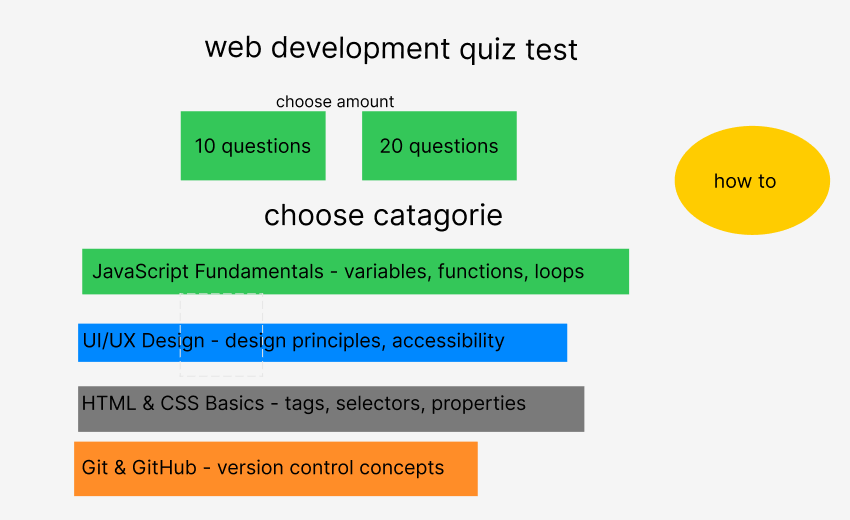
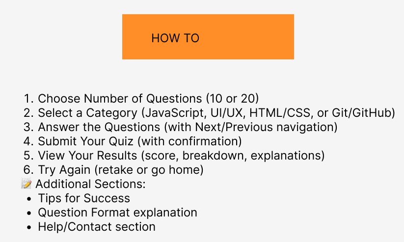
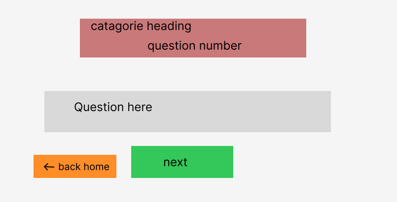
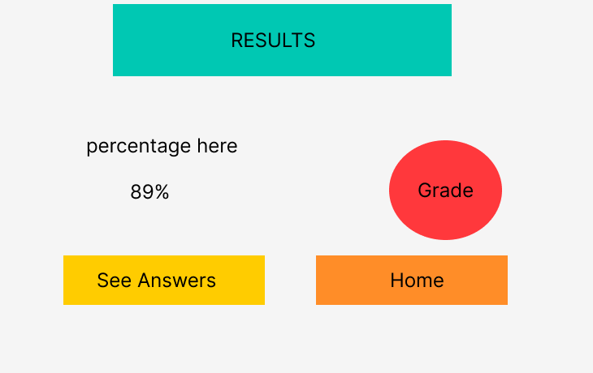

# Development Log - Online Quiz Project

## Project Information
- **Developer:** Ollie Adams
- **Start Date:** January 6, 2026
- **Project Type:** Interactive Web Application
- **Technologies:** HTML5, CSS3, JavaScript, jQuery

---

## Development Timeline

### Phase 1: Planning & Setup
**Date Started:**  January 6, 2026
**Date Completed:**

#### Quiz Theme Decision
**Chosen Theme:** Web Development Fundamentals (Multi-Category Quiz)

**Four Categories:**
1. **JavaScript Fundamentals** - Variables, functions, loops, and core JavaScript concepts
2. **UI/UX Design** - Design principles, accessibility, and user experience
3. **HTML & CSS Basics** - HTML tags, CSS selectors, properties, and structure
4. **Git & GitHub** - Version control concepts, commands, and workflows

**Reasoning:** These categories cover the essential skills I'm learning in web development. Creating quiz questions will reinforce my knowledge while building a practical project. The multi-category approach demonstrates versatility and allows users to test different aspects of web development.

#### Initial Setup
- Git repository initialized: [6/1/2026]
- Directory structure created: [6/1/2026]
- Initial commit: [Date]

#### Key Decisions:
- Design wireframes on Figma (4 pages: home, how-to, quiz, results)
- Deploy using GitHub Pages
- Use jQuery for DOM manipulation and enhanced interactivity
- Implement 4 quiz categories with random question selection
- Options for 10 or 20 questions total (mixed from all categories)
- Category-based color coding for visual organization (within 3-color limit)

#### Wireframes:
- Tool: Figma
- Pages designed: Home, How-To, Quiz, Results
- Wireframes location: `assets/images/wireframes/`
- Status: ✅ **Completed - January 6, 2026**
- Files:
  - `homepage.png` - Landing page with quiz start options
  - `howto.png` - Instructions and how to use the quiz
  - `questionpage.png` - Quiz interface with questions and navigation
  - `results.png` - Results page with score and answer review

**Wireframe Preview:**

*Homepage design showing landing page with quiz start options*

*How-To page design with step-by-step instructions*

*Quiz interface showing question display and navigation*

*Results page design with score display and answer review*

#### User Flow Defined:
1. User lands on home page
2. User clicks to start quiz or reads How-To instructions
3. User selects number of questions (10 or 20)
4. User selects category (JavaScript, UI/UX, HTML/CSS, or Git/GitHub)
5. User answers questions one by one with Next/Previous navigation
6. User clicks Submit when complete
7. User views results page with score and detailed answer review
8. User can retake quiz or return home

#### How-To Instructions Created:
- Content drafted: January 6, 2026
- Location: `HOW_TO_CONTENT.md`
- Will be implemented in `how-to.html` during Phase 3
- decide on color scheme 
---

### Phase 2: HTML Development
**Date Started:**  
**Date Completed:**

#### Structure Decisions:
- Number of pages: 4 (index, how-to, quiz, results)
- Navigation approach:
- Question display method:

#### Accessibility Considerations:
- Semantic elements used:
- ARIA labels added:
- Heading hierarchy:

#### Challenges & Solutions:
**Challenge:**  
**Solution:**  
**Date Resolved:**

---

### Phase 3: CSS Development
**Date Started:**  
**Date Completed:**

#### Design Decisions:
**Color Scheme:**
- Primary Color: [#HEX] - Used for:
- Secondary Color: [#HEX] - Used for:
- Accent Color: [#HEX] - Used for:

**Typography:**
- Font Family:
- Base Font Size:
- Heading Sizes:

**Layout Approach:**
- Mobile-first: Yes/No
- Grid/Flexbox:

#### Responsive Design Breakpoints:
- Mobile: 320px - 767px
- Tablet: 768px - 1023px
- Desktop: 1024px+

#### Challenges & Solutions:
**Challenge:**  
**Solution:**  
**Date Resolved:**

---

### Phase 4: JavaScript Development
**Date Started:**  
**Date Completed:**

#### jQuery Implementation:
- jQuery Version:
- CDN Source:
- Date Added:
- Used for: (DOM manipulation, event handling, animations, etc.)

#### Quiz Structure:
- Total questions created:
- Question types included:
- Randomization approach:

#### Core Functions Implemented:
1. **Function Name:** `shuffleQuestions()`
   - **Purpose:** Randomize question order
   - **Date Implemented:**

2. **Function Name:** `displayQuestion()`
   - **Purpose:** Show current question and options
   - **Date Implemented:**

3. **Function Name:** `checkAnswer()`
   - **Purpose:** Validate user answer
   - **Date Implemented:**

4. **Function Name:** `calculateScore()`
   - **Purpose:** Calculate final score
   - **Date Implemented:**

5. **Function Name:** `displayResults()`
   - **Purpose:** Show quiz results with explanations
   - **Date Implemented:**

#### Features Implemented:
- [ ] Question randomization
- [ ] Answer selection feedback
- [ ] Progress tracking
- [ ] Score calculation
- [ ] Results display with explanations
- [ ] Quiz restart functionality

#### Challenges & Solutions:
**Challenge:**  
**Solution:**  
**Date Resolved:**

---

### Phase 5: Testing & Debugging
**Date Started:**  
**Date Completed:**

#### Validation Results:
- HTML Validation: [Pass/Fail] - Date:
- CSS Validation: [Pass/Fail] - Date:
- JavaScript Validation: [Pass/Fail] - Date:

#### Major Bugs Found:
1. **Bug Description:**
   - **Impact:**
   - **Fix:**
   - **Date Fixed:**

#### Browser Testing Results:
- Chrome: [Status]
- Firefox: [Status]
- Edge: [Status]
- Safari: [Status]

---

### Phase 6: Deployment
**Date Started:**  
**Date Completed:**

#### Deployment Steps:
1. Final local testing completed: [Date]
2. All files committed to GitHub: [Date]
3. GitHub Pages enabled: [Date]
4. Live site tested: [Date]
5. Issues found and fixed: [Date]

**Live Site URL:**

---

## External Resources & Attribution

### Code Sources
1. **Source:**
   - **URL:**
   - **What was used:**
   - **Location in project:**
   - **Date added:**

2. **Source:**
   - **URL:**
   - **What was used:**
   - **Location in project:**
   - **Date added:**

### Libraries/Frameworks (if any)
1. **Name:**
   - **Version:**
   - **Purpose:**
   - **URL:**

### Tutorials Referenced
1. **Tutorial:**
   - **URL:**
   - **What was learned:**
   - **Date referenced:**

### Images/Assets
1. **Asset:**
   - **Source:**
   - **License:**
   - **URL:**

---

## Git Commit History Notes

### Important Commits:
- Initial commit: [hash] - [date]
- HTML structure complete: [hash] - [date]
- CSS styling complete: [hash] - [date]
- JavaScript functionality complete: [hash] - [date]
- Testing complete: [hash] - [date]
- Deployment: [hash] - [date]

---

## Lessons Learned

### What Went Well:

### Challenges Faced:

### What Would I Do Differently:

### Skills Developed:

---

## Project Statistics

- **Total Development Time:**
- **Total Lines of Code:**
  - HTML:
  - CSS:
  - JavaScript:
- **Total Commits:**
- **Total Questions Created:**
- **Files Created:**

---

## Future Enhancements (Optional)

Ideas for future versions:
1. 
2. 
3. 

---

**Development log maintained by:** Ollie Adams  

**Last updated:** [Date]
