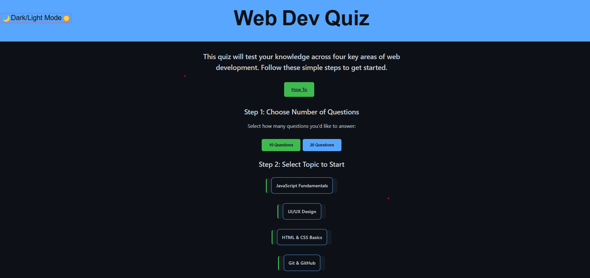
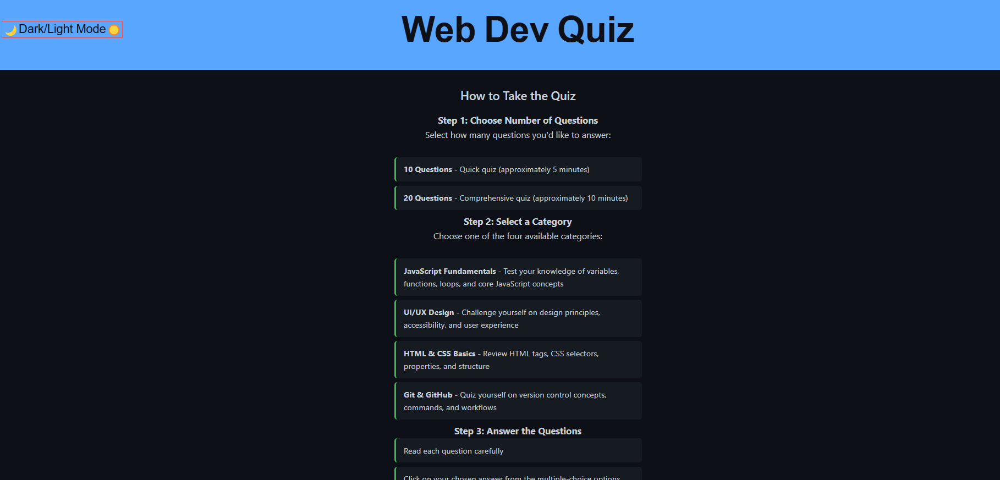
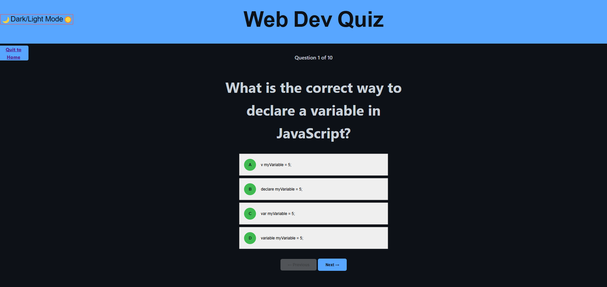
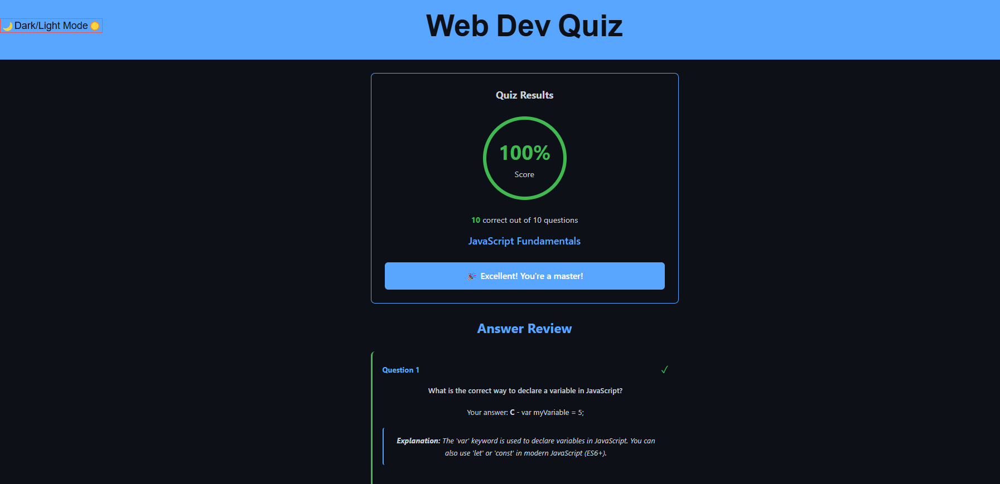

# Online Quiz Application



## Table of Contents
- [Overview](#overview)
- [Purpose & Value](#purpose--value)
- [Features](#features)
- [Technologies Used](#technologies-used)
- [Deployment](#deployment)
- [How to Use](#how-to-use)
- [Testing](#testing)
- [Credits](#credits)

---

## Overview

A comprehensive web development quiz application featuring four core categories: **JavaScript Fundamentals**, **UI/UX Design**, **HTML & CSS Basics**, and **Git & GitHub**. Test your knowledge across essential web development concepts with randomized questions and detailed explanations.

**Live Site:** (https://ollieadams23.github.io/WebDevQuiz)

---

## Purpose & Value

### Purpose
This online quiz application was developed to test and reinforce fundamental web development knowledge across four key areas:
- **JavaScript Fundamentals** - Variables, functions, loops, and core concepts
- **UI/UX Design** - Design principles and accessibility standards
- **HTML & CSS Basics** - Tags, selectors, properties, and structure
- **Git & GitHub** - Version control concepts and best practices

### Value to Users
- **Educational:** Users can test and expand their knowledge on one of the topics
- **Interactive Learning:** Immediate feedback helps users learn from their mistakes
- **Engaging Experience:** Randomized questions ensure a fresh experience each time
- **Accessible:** Designed with accessibility in mind to accommodate all users
- **Self-Assessment:** Users can track their performance and identify areas for improvement

---

## Features

### 🏠 Home Page


The home page welcomes users with a clean, modern design featuring the "Web Dev Quiz" title and dark/light mode toggle. Users can select their preferred number of questions (10 or 20) and choose from four quiz categories: JavaScript Fundamentals, UI/UX Design, HTML & CSS Basics, or Git & GitHub. A "How To" button provides access to detailed instructions.

**Value:** Provides a welcoming entry point with clear call-to-action to start the quiz.

---

### 📖 How To Page


The How To page provides clear, step-by-step instructions on using the quiz application. It explains the three question types (multiple-choice, true/false, and fill-in-the-blank), navigation controls, scoring system, and how to review results. The page includes a "Start Quiz" button for easy transition to the quiz.

**Value:** Ensures users understand how to take the quiz and what to expect, reducing confusion.

---

### ❓ Quiz Page


The quiz page displays one question at a time with a clean, distraction-free interface. Questions are presented with clear formatting, and answer options adapt based on question type (four buttons for multiple-choice, two for true/false, or a text input for fill-in-the-blank). A progress indicator tracks the user's position in the quiz.

**Features:**
- Randomized questions for each attempt
- Three question types: multiple-choice, true/false, and fill-in-the-blank
- Progress indicator showing current question number
- Clear answer selection with visual feedback
- Navigation buttons (Next/Previous/Submit)

**Value:** Provides an intuitive, user-friendly interface for taking the quiz with clear feedback.

---

### 📊 Results Page


The results page displays a comprehensive summary of the user's quiz performance, including their total score, percentage, and a complete review of all questions. Each question shows the user's answer, the correct answer, and a detailed explanation. Visual indicators (✓ for correct, ✗ for incorrect) make it easy to scan results.

**Features:**
- Total score and percentage
- Number of correct/incorrect answers
- Detailed answer review with explanations
- Visual indicators for correct/incorrect answers
- Option to retake quiz or return home

**Value:** Helps users understand their performance and learn from incorrect answers through detailed explanations.

---

### ♿ Accessibility Features
- High contrast color scheme (WCAG AAA compliant)
- **Dark Mode Toggle:** User-controlled theme switching between light and dark modes with preference saved via localStorage
- Semantic HTML structure
- Keyboard navigation support
- Screen reader friendly
- Clear focus indicators
- Alt text for all images
- Proper heading hierarchy

**Value:** Ensures all users, including those with disabilities, can fully access and use the application.

---

### 📱 Responsive Design
- Mobile-first approach
- Fully responsive on all devices
- Optimized layouts for phone, tablet, and desktop
- Touch-friendly buttons and interactions

**Value:** Users can take the quiz on any device with an optimal experience.

---

## Technologies Used

### Core Technologies
- **HTML5** - Semantic structure and content
- **CSS3** - Styling and responsive design
- **JavaScript (ES6+)** - Quiz functionality and interactivity
- **jQuery 3.7.1** - DOM manipulation and simplified JavaScript


### Development Tools
- **Git** - Version control
- **GitHub** - Repository hosting and deployment
- **GitHub Pages** - Live site hosting
- **VS Code** - Code editor

### Validation & Testing Tools
- W3C HTML Validator
- W3C CSS Validator (Jigsaw)
- JSHint - JavaScript linter
- Chrome DevTools


---

## Deployment

This project is deployed using GitHub Pages. The live site is automatically updated when changes are pushed to the main branch.

### Deployment Steps

1. **Navigate to Repository Settings**
   - Go to your GitHub repository
   - Click on the "Settings" tab

2. **Configure GitHub Pages**
   - Scroll down to the "Pages" section in the left sidebar
   - Under "Source", select "main" branch
   - Select "/ (root)" folder
   - Click "Save"

3. **Access Live Site**
   - Wait a few minutes for deployment to complete
   - Your site will be available at: `https://[your-username].github.io/[repository-name]/`
   - The URL will be displayed in the GitHub Pages section

### Local Development

To run this project locally:

1. **Clone the repository**
   ```bash
   git clone https://github.com/[your-username]/[repository-name].git
   ```

2. **Navigate to project directory**
   ```bash
   cd [repository-name]
   ```

3. **Open in browser**
   - Simply open `index.html` in your web browser
   - Or use a local server (e.g., Live Server extension in VS Code)

---

## How to Use

1. **Start the Quiz**
   - Click the "Start Quiz" button on the home page
   - Or read the instructions on the "How To" page first

2. **Answer Questions**
   - Read each question carefully
   - Select your answer by clicking on an option
   - Use "Next" to move to the next question
   - Use "Previous" to review earlier questions (if enabled)

3. **Submit Your Answers**
   - Click "Submit" when you've answered all questions
   - Or when you're ready to see your results

4. **View Results**
   - See your total score and percentage
   - Review correct and incorrect answers
   - Read explanations for each question

5. **Retake Quiz**
   - Click "Retake Quiz" to start again with randomized questions

---

## Testing

Comprehensive testing has been performed on this application. For detailed testing documentation, see [TESTING.md](TESTING.md).

### Summary of Testing
- ✅ HTML validated with W3C Validator (no errors)
- ✅ CSS validated with Jigsaw Validator (no errors)
- ✅ JavaScript validated with JSHint (no significant issues)
- ✅ Tested on multiple browsers (Chrome, Firefox, Edge, Safari)
- ✅ Tested on multiple devices (mobile, tablet, desktop)
- ✅ Accessibility tested for WCAG compliance
- ✅ All links and functionality working correctly

---

## Credits

### Code
- **jQuery 3.7.1** - JavaScript Library
  - Source: https://jquery.com/
  - CDN: https://code.jquery.com/jquery-3.7.1.min.js
  - License: MIT License
  - Usage: Used for DOM manipulation, event handling, and AJAX requests throughout the application

### Content
- Quiz questions and answers: generated by Copilot


### Acknowledgments
- [Your mentor's name] - Project guidance and support

### Resources Referenced
- Web Content Accessibility Guidelines (WCAG) 2.1 https://www.w3.org/TR/WCAG21/
- https://www.w3.org/WAI/WCAG21/Understanding/intro#understanding-the-four-principles-of-accessibility

- https://webaim.org/resources/contrastchecker/

---

## Author

**Ollie Adams**  
- GitHub: [Ollieadams23](https://github.com/Ollieadams23)


---

## License

This project is for educational purposes as part of (https://learningpeopleapac.percipio.com/).

---