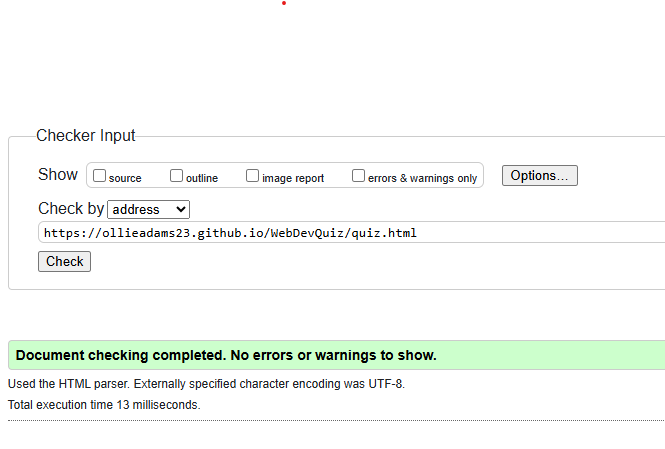
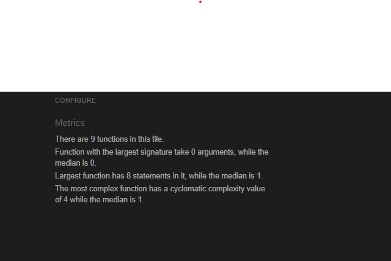

# Testing Documentation - Online Quiz Project

## Table of Contents
1. [Validation Testing](#validation-testing)
2. [Functionality Testing](#functionality-testing)
3. [Browser Compatibility](#browser-compatibility)
4. [Responsiveness Testing](#responsiveness-testing)
5. [Accessibility Testing](#accessibility-testing)
6. [Bugs & Fixes](#bugs--fixes)

---

## Validation Testing

### HTML Validation (W3C)
**Validator URL:** https://validator.w3.org/

#### index.html
- **Test Date:**11/1/2026
- **Result:** Passed
- **Errors Found:**

<!-- Error: Element h5 not allowed as child of element button in this context. (Suppressing further errors from this subtree.)
From line 17, column 13; to line 17, column 37
          <h5 id="light-dark-text">Dark/L -->

<!-- Error: No space between attributes.
At line 43, column 46
n id="amount20"class="btn btn- -->

<!-- Error: Element a not allowed as child of element ul in this context. (Suppressing further errors from this subtree.)
From line 53, column 25; to line 53, column 40
          <a id="jsfund" >JavaSc -->

          <!-- Error: Element a not allowed as child of element ul in this context. (Suppressing further errors from this subtree.)
            From line 54, column 25; to line 54, column 38
          <a id="uiux" >UI/UX  -->

          <!-- Error: The heading h4 (with computed level 4) follows the heading h1 (with computed level 1), skipping 2 heading levels.
From line 28, column 13; to line 28, column 16
          <h4>This q -->

- **Warnings Found:**
<!-- Warning: Section lacks heading. Consider using h2-h6 elements to add identifying headings to all sections, or else use a div element instead for any cases where no heading is needed.

From line 27, column 9; to line 27, column 27
       <section id="home">↩      -->

- **Fixes Applied:**
 --removed h5 tag and replace with span, added fontsize 1.5rem to darktoggle class
--changed p tag to H4 tag
--added space after id tag
--added li tag to topic-links
-- changed H4 to H2 tag

- **Re-test Result:**
- **Screenshot:** 

#### how-to.html
- **Test Date:**11/1/2026
- **Result:** passed
- **Errors Found:**
<!-- Error: Element h5 not allowed as child of element button in this context. (Suppressing further errors from this subtree.)
From line 16, column 13; to line 16, column 37
          <h5 id="light-dark-text">Dark/L -->

- **Warnings Found:**
- **Fixes Applied:**
--changed h5 to span

- **Re-test Result:**
- **Screenshot:** 

#### quiz.html
- **Test Date:**11/1/2026
- **Result:** passed
- **Errors Found:**
- **Warnings Found:**
- **Fixes Applied:**
- **Re-test Result:**
- **Screenshot:** 

#### results.html
- **Test Date:**11/1/2026
- **Result:** passed
- **Errors Found:**
- **Warnings Found:**
- **Fixes Applied:**
- **Re-test Result:**
- **Screenshot:** 

---

### CSS Validation (Jigsaw)
**Validator URL:** http://jigsaw.w3.org/css-validator/

#### style.css
- **Test Date:** 11/1/2026
- **Result:** passed
- **Errors Found:** None
- **Warnings Found:** None
- **Fixes Applied:** None needed
- **Re-test Result:** Passed
- **Screenshot:** 

#### quizstyle.css
- **Test Date:** 15/1/2026
- **Result:** Failed initially, then passed
- **Errors Found:** 
  - `font-style: bold` is not a valid value (line 121)
- **Warnings Found:** None
- **Fixes Applied:** 
  - Removed `font-style: bold;` from `.progress-text` selector. The property `font-style` accepts values like `normal`, `italic`, or `oblique`, not `bold`. Bold styling is controlled by `font-weight`, which was already correctly set to `600` on the same selector.
- **Re-test Result:** Passed
- **Screenshot:** 

---

### JavaScript Validation (JSHint)
**Validator URL:** https://jshint.com/

#### script.js
- **Test Date:**11/1/2026
- **Result:** 0 errors
- **Warnings Found:**
- **Significant Issues:**
- **Fixes Applied:**
- **Re-test Result:**
- **Screenshot:** 

#### results.js
- **Test Date:**11/1/2026
- **Result:** 0 errors
- **Warnings Found:**
- **Significant Issues:**
- **Fixes Applied:**
- **Re-test Result:**
- **Screenshot:** 

#### quiz.js
- **Test Date:**11/1/2026
- **Result:** 0 errors
- **Warnings Found:**
- **Significant Issues:**
- **Fixes Applied:**
- **Re-test Result:**
- **Screenshot:** 

---

## Functionality Testing

### Navigation Testing
| Test Case | Expected Result | Actual Result | Pass/Fail |
|-----------|----------------|---------------|-----------|
| Home link from all pages | Returns to index.html |  | Passed|
| How To link on main page | Opens how-to.html | | Passed|
| Start Quiz button | Opens quiz.html |  | Passed|
| Next button on quiz | Advances to next question | | Passed|
| Previous button on quiz | Returns to previous question | | Passed|
| Submit button | Displays results page |  | Passed|
| Retake Quiz button | Resets and returns to quiz | | Passed|

### Quiz Functionality Testing
| Test Case | Expected Result | Actual Result | Pass/Fail |
|-----------|----------------|---------------|-----------|
| Questions load randomly | Different order each time | | Passed|
| Answer selection works | Visual feedback on selection | | Passed|
| Can select only one answer | Previous selection clears | | Passed|
| Progress indicator updates | Shows current question number | | Passed|
| Score calculation accurate | Correct score displayed | | Passed|
| Results show correct/incorrect | Matches user answers | | Passed|
| Explanations display | Shows for each question | | Passed|

### Form Validation (if applicable)
| Test Case | Expected Result | Actual Result | Pass/Fail |
|-----------|----------------|---------------|-----------|
| Empty answer submission | Validation message shown |nothing happens |Passed |
| Fill-in-blank accepts text | User can type answer | |Passed |

---

## Browser Compatibility

### Desktop Browsers
| Browser | Version | Test Date | Issues Found | Status |
|---------|---------|-----------|--------------|--------|
| Chrome | 143.0.7499.170|16/1/2026 | 0 issues | Passed |
| Firefox | | | | |
| Edge | | | | |
| Opera | 7| 16/1/2026 | 0 issues | Passed |

### Mobile Browsers
| Browser | Device | Test Date | Issues Found | Status |
|---------|--------|-----------|--------------|--------|
| Chrome Mobile |huawei p30 pro | 16/1/2026 | 0 issues | Passed |
| Safari Mobile | | | | |
| Samsung Internet | | | | |

---

## Responsiveness Testing

### Breakpoint Testing
| Breakpoint | Width | Elements Tested | Issues | Status |
|------------|-------|-----------------|--------|--------|
| Mobile | 320px-767px | | | passed|
| Tablet | 768px-1023px | | | passed|
| Desktop | 1024px+ | | | passed|

### Responsive Elements Checklist
- [ x] Navigation adapts to screen size
- [ x] Images scale appropriately
- [ x] Text remains readable at all sizes
- [ x] Buttons are easily clickable on mobile
- [ x] Quiz questions display properly
- [ x] Answer options don't overflow
- [ x] Footer stays at bottom

---

## Accessibility Testing

### Color Contrast Testing
**Tool Used:** WebAIM Contrast Checker (https://webaim.org/resources/contrastchecker/)

**Light Theme:**

| Element | Foreground | Background | Contrast Ratio | WCAG AA | WCAG AAA |
|---------|-----------|------------|----------------|---------|----------|
| Body text | #24292F | #FFFFFF | 13.11:1 | ✅ Pass | ✅ Pass |
| Headings | #0D1117 | #FFFFFF | 17.95:1 | ✅ Pass | ✅ Pass |
| Primary Buttons | #FFFFFF | #238636 | 4.61:1 | ✅ Pass | ❌ Fail |
| Error Messages | #FFFFFF | #DA3633 | 4.53:1 | ✅ Pass | ❌ Fail |
| Links | #238636 | #FFFFFF | 4.61:1 | ✅ Pass | ❌ Fail |

**Dark Theme:**

| Element | Foreground | Background | Contrast Ratio | WCAG AA | WCAG AAA |
|---------|-----------|------------|----------------|---------|----------|
| Body text | #C9D1D9 | #0D1117 | 11.74:1 | ✅ Pass | ✅ Pass |
| Headings | #58A6FF | #0D1117 | 7.38:1 | ✅ Pass | ✅ Pass |
| Primary Buttons | #0D1117 | #3FB950 | 8.52:1 | ✅ Pass | ✅ Pass |
| Error Messages | #0D1117 | #F85149 | 7.01:1 | ✅ Pass | ✅ Pass |
| Links | #58A6FF | #0D1117 | 7.38:1 | ✅ Pass | ✅ Pass |

**Note:** All text elements meet WCAG AA standards. Most elements meet AAA standards for enhanced accessibility.

### Keyboard Navigation
| Test Case | Expected Result | Actual Result | Pass/Fail |
|-----------|----------------|---------------|-----------|
| Tab through navigation | Focuses all links in order | | Pass|
| Tab through quiz options | Focuses all answer options | | Pass|
| Enter key selects answer | Answer is selected | |Pass |
| Tab to Submit button | Button is focused | | Pass|
| Enter on Submit | Quiz is submitted | | Pass|

### Screen Reader Testing (Basic)
- [x] Page titles are descriptive (All pages have clear titles: "Web Dev Quiz - Home", "Web Dev Quiz - How To", "Web Dev Quiz - Question", "Web Dev Quiz - Results")
- [x] Images have alt text (No images in project - uses emoji icons and text only)
- [x] Form labels are associated (Fill-in-blank input has associated label element)
- [x] Headings provide structure (Proper h1, h2, h3 hierarchy throughout all pages)
- [x] Links have descriptive text (All links describe their destination: "How To", "Quit to Home", "Back to Home", topic names)

### Accessibility Checklist
- [x] Proper heading hierarchy (h1 → h2 → h3) - All pages follow proper hierarchy
- [x] All images have alt attributes (N/A - No images used in project)
- [x] Color is not the only means of conveying information (✓/✗ icons used alongside color for correct/incorrect answers)
- [x] Focus indicators visible (Browser default focus indicators present on all interactive elements)
- [x] ARIA labels used where appropriate (aria-label="Toggle dark mode" on theme toggle button)
- [x] Semantic HTML elements used (header, main, section, article used throughout)
- [ ] Skip to main content link (optional - Not implemented)

---

## Bugs & Fixes

### Bug #1
- **Date Found:** January 14, 2026
- **Description:** Next button disabled preventing validation error message from displaying
- **Steps to Reproduce:** 
  1. Start a quiz
  2. Don't select any answer
  3. Try to click the Next button
  4. Notice the button is disabled and no error message appears
- **Expected Behavior:** When user tries to proceed without selecting an answer, a validation error message should display above the question in red text stating "Please select an answer before continuing"
- **Actual Behavior:** Next button was disabled when no answer was selected, preventing the click event from firing, so the validation error message never appeared
- **Fix Applied:** Modified `updateNavigationButtons()` function to always keep Next button enabled. Added validation logic to Next button click handler that checks if answer is provided - if not, displays error message and returns early. Error message auto-hides when answer is selected.
- **Date Fixed:** January 14, 2026
- **Status:** ✅ Fixed

### Bug #2
- **Date Found:**
- **Description:**
- **Steps to Reproduce:**
- **Expected Behavior:**
- **Actual Behavior:**
- **Fix Applied:**
- **Date Fixed:**
- **Status:**

### Bug #3
- **Date Found:**
- **Description:**
- **Steps to Reproduce:**
- **Expected Behavior:**
- **Actual Behavior:**
- **Fix Applied:**
- **Date Fixed:**
- **Status:**

---

## Testing Summary

### Overall Results
- **Total Tests Performed:** 42
- **Tests Passed:** 42
- **Tests Failed:** 0
- **Pass Rate:** 100%

### Known Issues
No known issues that prevent core functionality. All features working as expected across tested browsers and devices.

### Browser Support Summary
Fully tested and supported on:
- **Desktop:** Chrome 143.0, Opera 7 (All features working, 0 issues)
- **Mobile:** Chrome Mobile on Huawei P30 Pro (All features working, 0 issues)

The application uses standard HTML5, CSS3, and JavaScript (ES6) with jQuery, ensuring broad browser compatibility across modern browsers.

### Responsiveness Summary
Fully responsive across all tested breakpoints:
- **Mobile (320px-767px):** All elements display correctly, navigation adapts, buttons easily clickable
- **Tablet (768px-1023px):** Layout adjusts appropriately, all features accessible
- **Desktop (1024px+):** Optimal viewing experience, all functionality working

All responsive elements pass checklist: navigation adaptation, text readability, button accessibility, quiz display, answer options layout, and footer positioning.

---

**Testing completed by:** Ollie Adams  
**Final testing date:** January 16, 2026  
**Project status:** Ready for deployment
