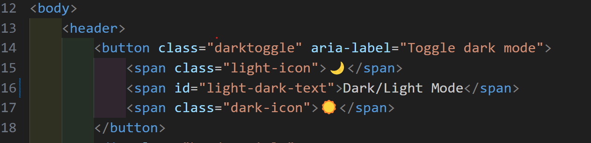

# Testing Documentation - Online Quiz Project

## Table of Contents
1. [Validation Testing](#validation-testing)
2. [Functionality Testing](#functionality-testing)
3. [Browser Compatibility](#browser-compatibility)
4. [Responsiveness Testing](#responsiveness-testing)
5. [Accessibility Testing](#accessibility-testing)
6. [Bugs & Fixes](#bugs--fixes)

---

## Validation Testing

### HTML Validation (W3C)
**Validator URL:** https://validator.w3.org/

#### index.html
- **Test Date:**11/1/2026
- **Result:** Passed
- **Errors Found:**

<!-- Error: Element h5 not allowed as child of element button in this context. (Suppressing further errors from this subtree.)
From line 17, column 13; to line 17, column 37
          <h5 id="light-dark-text">Dark/L -->

<!-- Error: No space between attributes.
At line 43, column 46
n id="amount20"class="btn btn- -->

<!-- Error: Element a not allowed as child of element ul in this context. (Suppressing further errors from this subtree.)
From line 53, column 25; to line 53, column 40
          <a id="jsfund" >JavaSc -->

          <!-- Error: Element a not allowed as child of element ul in this context. (Suppressing further errors from this subtree.)
            From line 54, column 25; to line 54, column 38
          <a id="uiux" >UI/UX  -->

          <!-- Error: The heading h4 (with computed level 4) follows the heading h1 (with computed level 1), skipping 2 heading levels.
From line 28, column 13; to line 28, column 16
          <h4>This q -->

- **Warnings Found:**
<!-- Warning: Section lacks heading. Consider using h2-h6 elements to add identifying headings to all sections, or else use a div element instead for any cases where no heading is needed.

From line 27, column 9; to line 27, column 27
       <section id="home">↩      -->

- **Fixes Applied:**
 --removed h5 tag and replace with span, added fontsize 1.5rem to darktoggle class
--changed p tag to H4 tag
--added space after id tag
--added li tag to topic-links
-- changed H4 to H2 tag

- **Re-test Result:**
- **Screenshot:** 

#### how-to.html
- **Test Date:**11/1/2026
- **Result:** passed
- **Errors Found:**
<!-- Error: Element h5 not allowed as child of element button in this context. (Suppressing further errors from this subtree.)
From line 16, column 13; to line 16, column 37
          <h5 id="light-dark-text">Dark/L -->

- **Warnings Found:**
- **Fixes Applied:**
--changed h5 to span

- **Re-test Result:**
- **Screenshot:** 

#### quiz.html
- **Test Date:**11/1/2026
- **Result:** passed
- **Errors Found:**
- **Warnings Found:**
- **Fixes Applied:**
- **Re-test Result:**
- **Screenshot:** 

#### results.html
- **Test Date:**11/1/2026
- **Result:** passed
- **Errors Found:**
- **Warnings Found:**
- **Fixes Applied:**
- **Re-test Result:**
- **Screenshot:** 

---

### CSS Validation (Jigsaw)
**Validator URL:** http://jigsaw.w3.org/css-validator/

#### style.css
- **Test Date:**11/1/2026
- **Result:** passed
- **Errors Found:**

- **Warnings Found:**
- **Fixes Applied:**
- **Re-test Result:**
- **Screenshot:** 

---

### JavaScript Validation (JSHint)
**Validator URL:** https://jshint.com/

#### script.js
- **Test Date:**11/1/2026
- **Result:** 0 errors
- **Warnings Found:**
- **Significant Issues:**
- **Fixes Applied:**
- **Re-test Result:**
- **Screenshot:** 

#### results.js
- **Test Date:**11/1/2026
- **Result:** 0 errors
- **Warnings Found:**
- **Significant Issues:**
- **Fixes Applied:**
- **Re-test Result:**
- **Screenshot:** 

#### quiz.js
- **Test Date:**11/1/2026
- **Result:** 0 errors
- **Warnings Found:**
- **Significant Issues:**
- **Fixes Applied:**
- **Re-test Result:**
- **Screenshot:** 

---

## Functionality Testing

### Navigation Testing
| Test Case | Expected Result | Actual Result | Pass/Fail |
|-----------|----------------|---------------|-----------|
| Home link from all pages | Returns to index.html | Passed | |
| How To link on main page | Opens how-to.html | Passed| |
| Start Quiz button | Opens quiz.html |Passed | |
| Next button on quiz | Advances to next question | Passed| |
| Previous button on quiz | Returns to previous question |Passed | |
| Submit button | Displays results page |Passed | |
| Retake Quiz button | Resets and returns to quiz | Passed| |

### Quiz Functionality Testing
| Test Case | Expected Result | Actual Result | Pass/Fail |
|-----------|----------------|---------------|-----------|
| Questions load randomly | Different order each time | Passed| |
| Answer selection works | Visual feedback on selection | Passed| |
| Can select only one answer | Previous selection clears | Passed| |
| Progress indicator updates | Shows current question number | Passed| |
| Score calculation accurate | Correct score displayed |Passed | |
| Results show correct/incorrect | Matches user answers | Passed| |
| Explanations display | Shows for each question |Passed | |

### Form Validation (if applicable)
| Test Case | Expected Result | Actual Result | Pass/Fail |
|-----------|----------------|---------------|-----------|
| Empty answer submission | Validation message shown |Fail | |
| Fill-in-blank accepts text | User can type answer | Passed| |

---

## Browser Compatibility

### Desktop Browsers
| Browser | Version | Test Date | Issues Found | Status |
|---------|---------|-----------|--------------|--------|
| Chrome | | | | |
| Firefox | | | | |
| Edge | | | | |
| Safari | | | | |

### Mobile Browsers
| Browser | Device | Test Date | Issues Found | Status |
|---------|--------|-----------|--------------|--------|
| Chrome Mobile | | | | |
| Safari Mobile | | | | |
| Samsung Internet | | | | |

---

## Responsiveness Testing

### Device Testing Matrix
| Device | Screen Size | Orientation | Layout Issues | Status |
|--------|-------------|-------------|---------------|--------|
| iPhone SE | 375x667 | Portrait | | |
| iPhone SE | 667x375 | Landscape | | |
| iPhone 12 Pro | 390x844 | Portrait | | |
| iPad Mini | 768x1024 | Portrait | | |
| iPad Mini | 1024x768 | Landscape | | |
| iPad Pro | 1024x1366 | Portrait | | |
| Laptop | 1366x768 | - | | |
| Desktop | 1920x1080 | - | | |

### Breakpoint Testing
| Breakpoint | Width | Elements Tested | Issues | Status |
|------------|-------|-----------------|--------|--------|
| Mobile | 320px-767px | | | |
| Tablet | 768px-1023px | | | |
| Desktop | 1024px+ | | | |

### Responsive Elements Checklist
- [ ] Navigation adapts to screen size
- [ ] Images scale appropriately
- [ ] Text remains readable at all sizes
- [ ] Buttons are easily clickable on mobile
- [ ] Quiz questions display properly
- [ ] Answer options don't overflow
- [ ] Footer stays at bottom

---

## Accessibility Testing

### Color Contrast Testing
**Tool Used:** WebAIM Contrast Checker (https://webaim.org/resources/contrastchecker/)

| Element | Foreground | Background | Contrast Ratio | WCAG AA | WCAG AAA |
|---------|-----------|------------|----------------|---------|----------|
| Body text | | | | | |
| Headings | | | | | |
| Buttons | | | | | |
| Links | | | | | |

### Keyboard Navigation
| Test Case | Expected Result | Actual Result | Pass/Fail |
|-----------|----------------|---------------|-----------|
| Tab through navigation | Focuses all links in order | | |
| Tab through quiz options | Focuses all answer options | | |
| Enter key selects answer | Answer is selected | | |
| Tab to Submit button | Button is focused | | |
| Enter on Submit | Quiz is submitted | | |

### Screen Reader Testing (Basic)
- [ ] Page titles are descriptive
- [ ] Images have alt text
- [ ] Form labels are associated
- [ ] Headings provide structure
- [ ] Links have descriptive text

### Accessibility Checklist
- [ ] Proper heading hierarchy (h1 → h2 → h3)
- [ ] All images have alt attributes
- [ ] Color is not the only means of conveying information
- [ ] Focus indicators visible
- [ ] ARIA labels used where appropriate
- [ ] Semantic HTML elements used
- [ ] Skip to main content link (optional)

---

## Bugs & Fixes

### Bug #1
- **Date Found:**
- **Description:**
- **Steps to Reproduce:**
- **Expected Behavior:**
- **Actual Behavior:**
- **Fix Applied:**
- **Date Fixed:**
- **Status:**

### Bug #2
- **Date Found:**
- **Description:**
- **Steps to Reproduce:**
- **Expected Behavior:**
- **Actual Behavior:**
- **Fix Applied:**
- **Date Fixed:**
- **Status:**

### Bug #3
- **Date Found:**
- **Description:**
- **Steps to Reproduce:**
- **Expected Behavior:**
- **Actual Behavior:**
- **Fix Applied:**
- **Date Fixed:**
- **Status:**

---

## Testing Summary

### Overall Results
- **Total Tests Performed:**
- **Tests Passed:**
- **Tests Failed:**
- **Pass Rate:**

### Known Issues
*List any remaining issues that don't prevent core functionality*

### Browser Support Summary
*Summary of which browsers/versions are fully supported*

### Responsiveness Summary
*Summary of which devices are fully supported*

---

**Testing completed by:** [Your Name]  
**Final testing date:** [Date]  
**Project status:** [Ready for deployment / Needs fixes]
